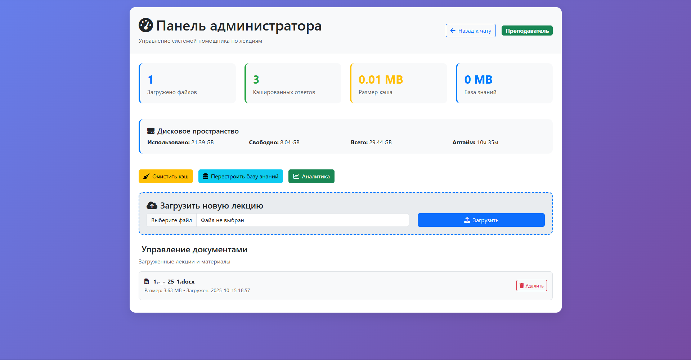
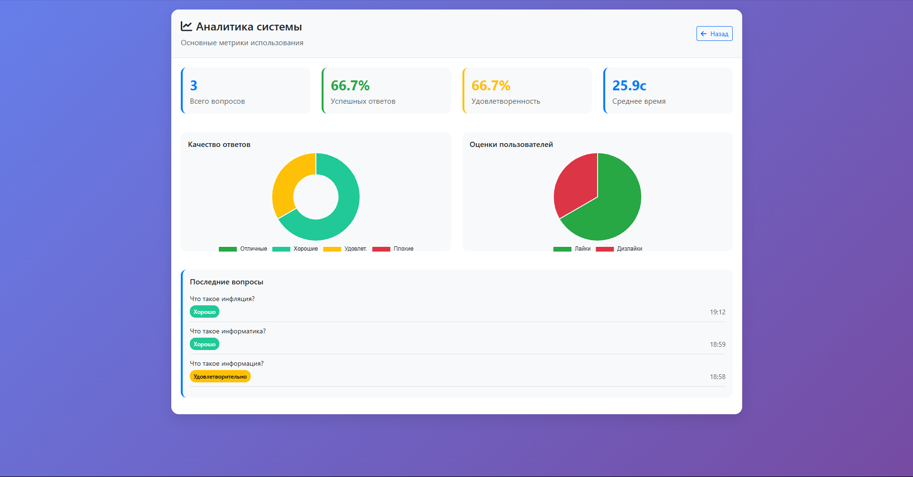
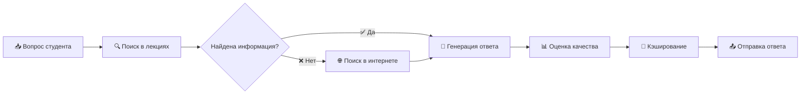

# 🎓 INFGPT - Интеллектуальный помощник по лекциям

[](https://python.org)
[](https://flask.palletsprojects.com/)
[](https://langchain.com)
[](https://opensource.org/licenses/MIT)

**Умная система анализа учебных материалов с AI-ассистентом и системой оценки качества ответов**

---

## ✨ Возможности

### 🎯 Для студентов
- **💬 Интеллектуальный чат** - задавайте вопросы по лекциям на естественном языке
- **🔍 Гибридный поиск** - ответы из материалов лекций + интернет-источники
- **📚 Подсветка источников** - точные цитаты из учебных материалов
- **⭐ Оценка качества** - система рейтинга полезности ответов
- **🎨 Поддержка формул** - красивый рендеринг математических выражений

### 👨‍🏫 Для преподавателей
- **📁 Управление материалами** - загрузка PDF/DOCX лекций
- **📊 Панель аналитики** - детальная статистика использования
- **⚙️ Администрирование** - управление кэшем и векторной базой
- **📈 Мониторинг качества** - отслеживание эффективности системы

---

## 📸 Скриншоты

<div align="center">

| Главный интерфейс | Панель администратора | Аналитика |
|:---:|:---:|:---:|
| [](screenshots/main.png) | [](screenshots/admin.png) | [](screenshots/analytics.png) |
| **Главный интерфейс** | **Панель администратора** | **Аналитика** |

*Нажмите на изображение для просмотра в полном размере*

</div>

---

## 🔄 Алгоритм работы



---

## 🏗️ Архитектура системы

```mermaid
graph TB
    A[Веб-интерфейс] --> B[Flask Backend]
    B --> C[Векторная база ChromaDB]
    B --> D[Языковая модель Ollama]
    B --> E[Поиск DuckDuckGo]
    C --> F[Обработка PDF/DOCX]
    D --> G[Генерация ответов]
    E --> G
    G --> H[Оценка качества]
    H --> I[Кэширование]
    I --> A
